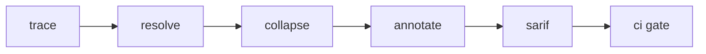

# stackexplain

[](https://www.npmjs.com/package/stackexplain)

```json
{
  "name": "stackexplain",
  "kind": "cli + library",
  "runtime": "node >= 18",
  "entry": ["./bin/explain.mjs", "./dist/index.js"],
  "targets": ["linux-x64", "darwin-arm64", "win32-x64"]
}
```

## strip-ansi

```
stackexplain/
├── resolve/
│   ├── frames.py
│   └── demangle.rs
├── collapse/
│   └── groups.ts
├── annotate/
│   ├── hints.py
│   └── labels.json
└── export/
    └── sarif.py
```

### migrate



## no-strict-math

1. `npx stackexplain add <trace>` — normalise a run and store it
2. `npx stackexplain explain <run-id>` — print collapsed groups with per-frame hints
3. `npx stackexplain export --format sarif` — machine-readable output for review bots
4. `npx stackexplain prune --older 30d` — drop stored runs

> Runs live as plain files under `.stackexplain/runs`, so the same store works on a laptop and in a
> container. Nothing leaves the machine unless an export step is run.

## routing

| handler | scope |
|---|---|
| `resolve` | frame extraction, symbol demangling |
| `collapse` | merge repeated frames into groups |
| `annotate` | attach hints from the local index |
| `export` | sarif / json writers |

#### install-stats

`STACKEXPLAIN_STORE`
: where runs are kept when `--store` is omitted

`STACKEXPLAIN_LANG`
: force a language handler instead of detecting one from the trace

`STACKEXPLAIN_OFFLINE`
: never touch the network while annotating

## eldap

Incoming work is a patch plus a short note saying which handler it touches. If a change spans more than
one handler, open a thread before the patch — it keeps review honest.

[1]: https://graymuzzle-labs.dev/stackexplain/contributing
[2]: https://graymuzzle-labs.dev/stackexplain/handlers
[3]: https://graymuzzle-labs.dev/stackexplain/ci

## Minimee

No single licence covers the whole tree: handlers adapted from other projects keep their own terms, the
rest is MIT. Attribution sits next to the code it belongs to.